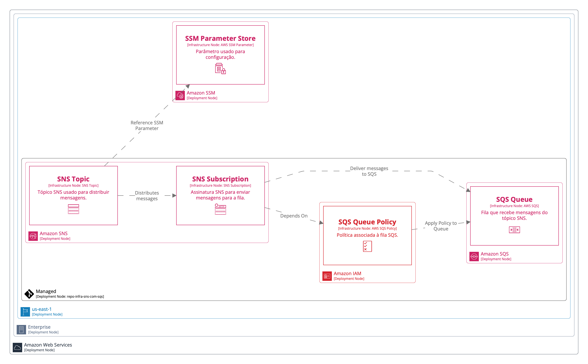

# Processo de ETL para o Terraform

Esta documentação descreve o processo de extração, transformação e organização dos dados gerados pelo Terraform, com o objetivo de criar um JSON estruturado para gerar diagramas de deployment de infraestrutura com Structurizr.

**Diagrama de Deploy:**


**Keys:**


## Visão Geral

Este script processa os dados gerados pelo comando `terraform show -json`, extraindo informações sobre:

- **Metadados**: Dados globais, como provedor e região.
- **Recursos**: Separados em managed (gerenciados pelo repositório) e data (fontes de dados externas apenas consultadas).
- **Relacionamentos**: Dependências explícitas (`depends_on`) e referências implícitas entre os recursos.

O resultado é um JSON consolidado que organiza recursos por modo (`managed` ou `data`) e por tipo, além de listar os relacionamentos entre eles.

## Comandos para Gerar o JSON

Antes de executar o script Python, você precisa gerar o JSON de entrada a partir do Terraform:

1.	Inicialize o Terraform:

```bash
terraform init
```

2.	Planeje as mudanças:

```bash
terraform plan -out=tfplan
```

3.	Gere o JSON:

```bash
terraform show -json tfplan > terraform_state.json
```

O arquivo `terraform_state.json` é a entrada principal para o script Python.

## Estrutura do Script

O script é dividido em etapas principais:

**1. Remoção de Valores Vazios**

A função `clean_dict` remove valores nulos, listas vazias e objetos vazios do JSON para simplificar os dados:

```python
def clean_dict(obj):
    # Remove valores nulos, listas e objetos vazios
```

**2. Extração de Metadados**

A função `extract_metadata` extrai informações sobre o provedor (e.g., AWS) e a região:

```python
def extract_metadata(terraform_json):
    # Extrai o provedor e a região do JSON
```

**3. Organização de Recursos por Modo e Tipo**

A função `organize_resources_by_mode` categoriza os recursos em managed e data, e os agrupa por tipo dentro de cada categoria:

```python
def organize_resources_by_mode(resources):
    # Organiza os recursos por modo (managed/data) e tipo
```

**4. Extração de Relacionamentos**

A função `extract_relationships` analisa explicitamente os campos `depends_on` e referências em `expressions` para identificar dependências **explícitas** e **implícitas**:

```python
def extract_relationships(resources):
    # Extrai relacionamentos explícitos e implícitos entre os recursos
```

Regras de Relacionamentos:

- `depends_on`: Relacionamentos explícitos declarados no código Terraform.
- `reference`: Referências implícitas identificadas em expressions.

**5. Normalização de Referências**

A função `normalize_reference` ajusta os identificadores de recursos para remover ambiguidades, considerando:

- Recursos `managed`: Normalizados para `tipo.nome`.
- Recursos `data`: Normalizados para `data.tipo.nome`.

```python
def normalize_reference(reference):
    # Normaliza as referências com base no modo do recurso
```

**6. Limpeza de Dados**

As funções `remove_references_from_resources` e `clean_dict` eliminam campos desnecessários e propriedades vazias, deixando o JSON final mais legível e útil:

```python
def clean_resources(resources, remove_references=True):
    # Limpa propriedades desnecessárias e referências
```

## Fluxo do Script

O fluxo principal do script está encapsulado na função `process_terraform`:

```python
def process_terraform(terraform_json):
    # Pipeline principal para extrair, organizar e limpar dados
```

**Etapas do Fluxo:**

1. Carregar os dados do Terraform (`terraform_state.json)`.
2. Organizar os recursos por por managed e data, e organiza por tipo.
3. Extrair relacionamentos explícitos e implícitos.
4. Limpar valores desnecessários e referências extraídas.

## Saída Final

O script gera um arquivo chamado `c4_deployment_data.json` contendo:

1.	Metadados:
	- Provedor (`provider`) e região (`region`).

2.	Recursos:
	- Organizados por managed e data, com agrupamento por tipo.

3.	Relacionamentos:
	- Dependências explícitas e referências implícitas entre os recursos.

**Formato Exemplo:**

```json
{
  "metadata": {
    "provider": "aws",
    "region": "us-east-1"
  },
  "resources": {
    "managed": {
      "aws_sns_topic": [
        {
          "address": "aws_sns_topic.example_topic",
          "name": "example_topic"
        }
      ]
    },
    "data": {
      "aws_ssm_parameter": [
        {
          "address": "data.aws_ssm_parameter.example_param",
          "name": "example_param"
        }
      ]
    }
  },
  "relationships": [
    {
      "from": "aws_sns_topic.example_topic",
      "to": "data.aws_ssm_parameter.example_param",
      "type": "reference"
    }
  ]
}
```

## Conclusão

Este script transforma os dados brutos do Terraform em um JSON estruturado para facilitar a criação de diagramas de deployment ou outras análises de infraestrutura. A categorização por managed e data proporciona maior clareza sobre os recursos gerenciados e consultados, permitindo representações precisas no diagrama final.
